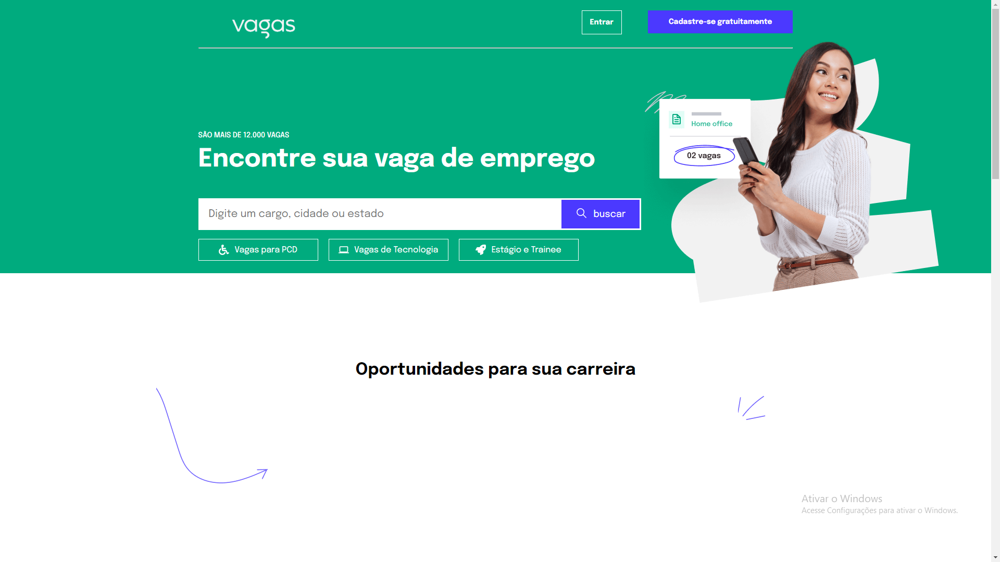
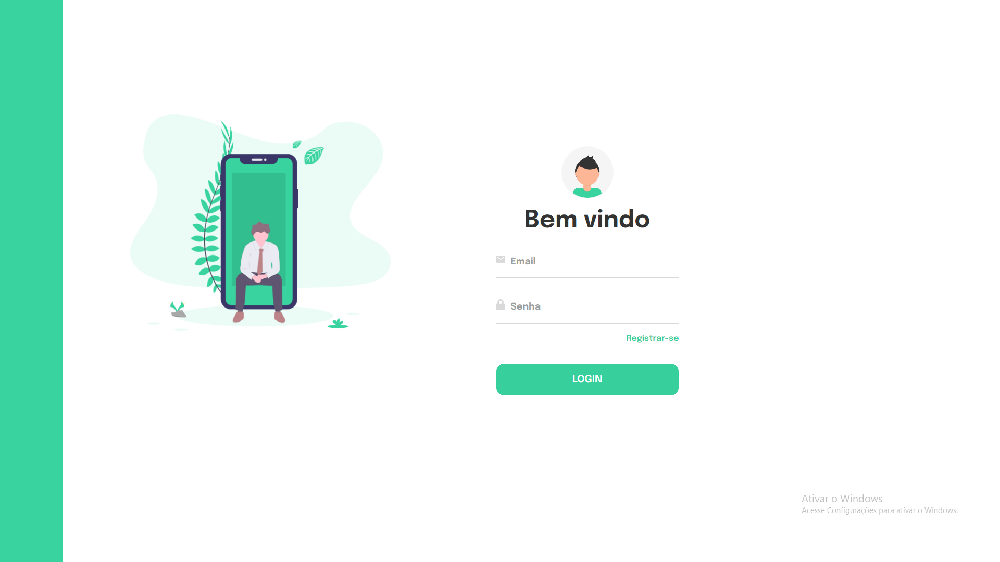
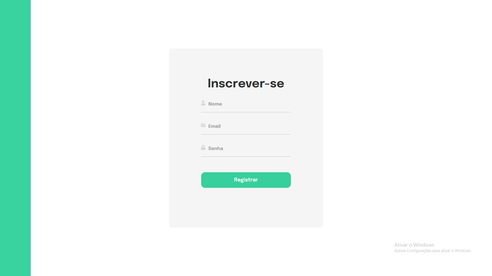
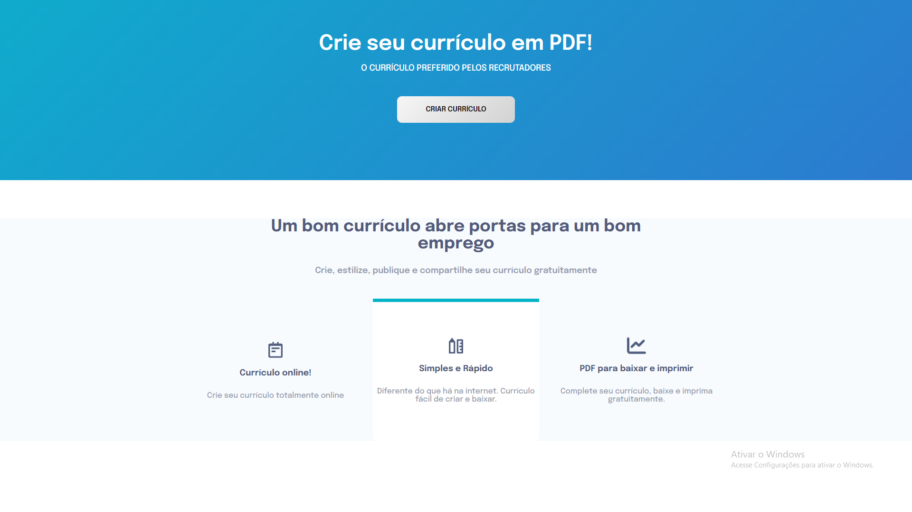
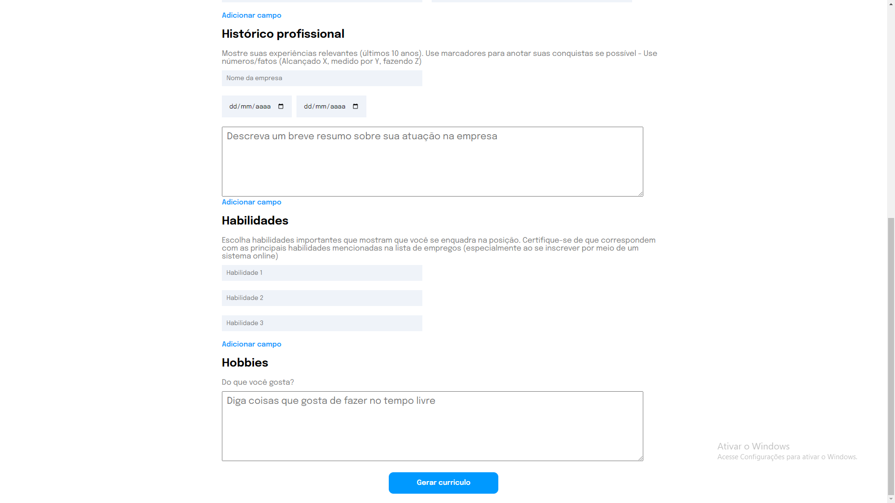

<a href="https://job-ai-yf7m.vercel.app/"> <h1 align="center" > JobAI Plataform </h1> </a>

 

    
  
  
  
  
 

#  📝 Descrição do projeto

  O JobAI é uma plataforma de busca de empregos projetada para conectar candidatos a empregadores de forma eficiente. Os usuários podem criar uma conta, fazer login para acessar todas as funcionalidades da plataforma, e pesquisar vagas de emprego inserindo o cargo desejado, e opcionalmente, o estado ou área de interesse. Além disso, eles podem criar currículos personalizados com nosso gerador de currículo integrado. Estamos constantemente trabalhando para aprimorar o JobAI e proporcionar uma experiência ainda melhor aos nossos usuários

 

# 🚀 Tecnologias e bibliotecas

Esse projeto está sendo desenvolvido com as seguintes tecnologias:

Front-end
- React.JS
- Axios
- Styled-components
- React-router-dom
- React Toastify
- React Icons

Back-end
- NodeJS
- Express
- Nodemon
- Bcrypt
- Cookie-parser
- Json Web Token
- Cors
   
Banco de dados:  
-PostgreSQL

# ⏭️ Atualizações futuras

- Testes E2E e unitarios
- Dockerização
- Personalização do PDF
- Paginação do retorno da busca dos empregos
- Responsividade para mobil

